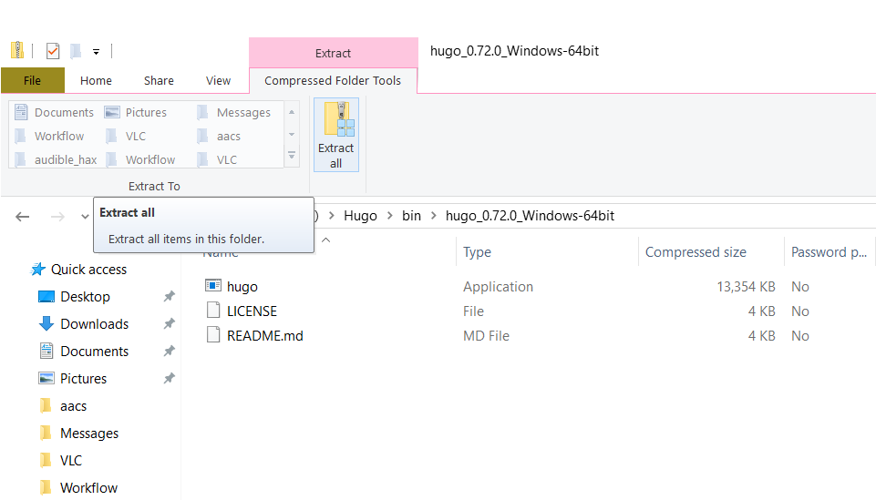
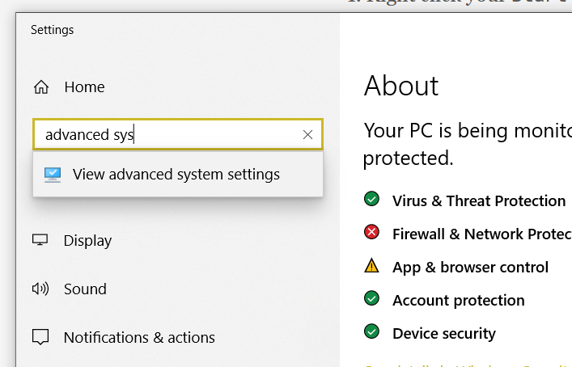
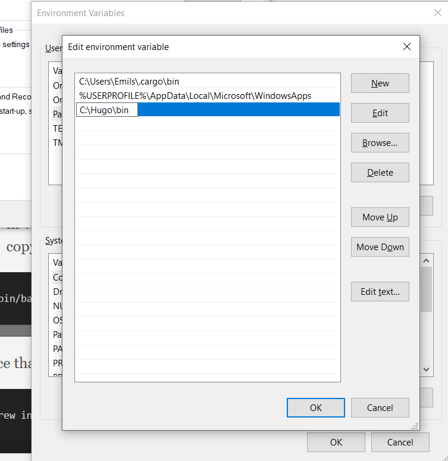

# Where to find this site
This is the "official" course website. All the material we go through will be on this site, as will links to all tools and products used in this course.

We've tried to design this course to be open-ended, so that if some of you have the time and desire to explore further, you can. Most topics will have suggestions for extra activities and options to expand, however, none of these will be assumed in further lessons.

If at any point you're struggling, ask for help. The lessons are aimed to be medium pace, but we're definitely not leaving anyone behind, and we have people who are specifically here to help you. Please let us know as soon as possible if something is not working as described.

We will need some tools and accounts for this course.

This site is largely made using the technologies explored in this course, and the source code for it can be freely explored [on Github](https://github.com/uswitch/codef-syllabus/).

# Assumptions
We've tried to specifically **not** make any assumptions about your individual setups, but everyone's computer is different.

We've given instructions for Windows & macOS, for our recommended tools.

If you feel like you're familiar with an aspect of the course, you're free to diverge and / or not use the suggested setup. For example

- if you're well familiar with how to use git on the command line, we're not going to force you to use one of the suggested UIs
- if you have a favourite editor you're comfortable with, we're not forcing you to use Sublime

If you're running Linux, we've tried our best to suggest options, but to an extent, we're also assuming that you're running Linux because you know what you're doing. Linux generally provides unlimited customisability, and it's not feasible for us to cover everyone's individual setups here. Same rules apply, if you're struggling with anything, please ask for help, and we will do our best.

# Intro
During this course we will create a website and deploy it to a publicly accesible place. The aim is to show you that you can build a decent looking website quickly, and get it out to the public, for entirely free. One of the core philosophical goals of the internet was (and still is) democratising access to information. We want to show you how _easy_ it is to do that using a platform you build yourself.

We'll cover a fairly broad range of skills, going through some basic applications of them. Creating a high quality, good looking website takes more in-depth studying of all of them, but this course is more about showing you what goes into it, than making you an expert in any one area. All the things we're covering have _lots_ of free material online, and we'll link to more in-depth reading at the end of each section, should you be interested in delving deeper into a particular area.

The tools we're using are widely used in the industry, and power _lots_ of things already present on the internet.

We make no assumptions about the content of your site, we leave that up to you. I can be an online CV, a portfolio, a fan page for your cat, or anything else you can come up with.

We encourage you to stay within copyright law, e.g., if you need an image for something like a banner, please don't just go to Google Images and grab the first thing you find. There are ways to find legal content, e.g., Google Images allows you to specify you want to search specifically for images you can reuse, it's under `Tools -> Usage rights`.

Finally, throughout the course, we encourage you to experiment! Make changes to things, see what happens. The beauty of **software** engineering is that unlike, e.g., mechanical engineering, typically nothing is irreversible, and nothing has any consequences beyond some characters displayed on a screen. If you make a mistake on your computer, nothing explodes, no physical harm comes to anyone, nor is there any financial loss to anyone or anything. A bruised ego is the worst you get. So play around, explore, _do_ break something if only to see what happens when things go up in smoke!

## First day
This first day is largely about setting up and getting comfortable with the tools we'll use.

We'll need 4 things

- an editor
- a Git interface
- a Github account
- and the tool we use to create the site, Hugo

The first 3 can be done in parallel should you choose to, you'll need to install 2 apps and sign up for 1 account.
Installing Hugo is more involved, but we guide you through that step-by-step.

There is some use of a _terminal_, but we provide all exact commands you need. Terminals are a very commonly used tool in the software industry, though we appreciate they look rather daunting at first.

## Some productivity tips
It is probably going to be useful having either the course site or the Zoom meeting up at the same time as doing things with the other apps.

In Windows you can either drag the window against either side or corner of the screen to make it "snap" to that side or corner. This can also be achieved with your keyboard, pressing Win + ➡️  will snap the current window to the right side of the screen, pressing Win + ➡️ ⬆️ will snap the current window to the top right quadrant.

In Mac it's probably easiest to utilise multiple workspaces to quickly switch between the Zoom meeting, the browser with the syllabus, and you ongoing work, though there are productivity apps to allow similar side-by-side snapping, Magnet is a popular one.

# Editor
We're going to be using an editor called [Sublime Text 3](https://www.sublimetext.com/3).

Download and install the version appropriate for your platform, it should be straight-forward.

# Github
We will need to register for a website called [Github](https://github.com/).

If you already have an account, hopefully you remember your password!

If you don't you'll need to sign up. It's free, and it won't spam you.

1. Go to the site
2. Click on the `Sign Up` button in the top right corner
3. Fill in your email and a password
4. Ignore their survey and just click `Complete setup` at the bottom
5. Check your email for a link to verify your email address
6. Click the small link `skip this for now` at the bottom when it offers you to learn things
7. You should now see a "welcome to github" page

# Git
Git is a [Version Control System](https://en.wikipedia.org/wiki/Version_control). In its most basic form, this means it can save the state of your files in a particular point in time.
The implication here is that if you make a mistake, you can easily revert that mistake. When you have something that works, you can save that state. Then, when you make changes, if something breaks, instead of trying to remember what you changed, you can just tell the computer to go back to your previous saved state.

To use Git, we're going to use an app called [GitKraken](https://www.gitkraken.com/).

Download and install the version appropriate for your platform.

# Hugo
Finally, we want to install [Hugo](https://gohugo.io/getting-started/installing). Hugo is what's called a "static site generator". What this means is that Hugo takes some content from our folder, and compiles that into a website that can be published somewhere. This may sound simplistic, but in reality a _shocking_ amount of the Internet is powered by things like these. Most small business websites, portfolio sites, blogs, even small shops are powered by static websites. If you've ever heard of or used sites like SquareSpace, they're just nice interfaces for a static site generator. SquareSpace is £120 per year. You can host one of these **literally** for free, and we'll show you how.

## Windows
If you're using a package manager like Chocolatey, it should be present there.

If not, you should be able to follow the [official installation directions](https://gohugo.io/getting-started/installing#less-technical-users)

What you'll need to do is

1. Download a Windows [release of Hugo](https://github.com/gohugoio/hugo/releases/download/v0.72.0/hugo_0.72.0_Windows-64bit.zip)
2. Make a directory named `Hugo` in your `C:` drive
3. Make a directory named `bin` in the newly made `Hugo` diretory
4. Move the file you downloaded into this `bin` folder



5. Unzip the file directly into the `bin` directory


6. You should now see 3 files, one of which is `hugo.exe`


Then you'll need to make Hugo executable from a terminal, which is something we'll need later. To do this

1. Right click your `Start` button
2. Click `System`


3. Start typing `Advanced System Settings` into the search bar



4. Click on the `Environment Variables` button on the bottom


5. In the `User variables` section, find the row that starts with `PATH` (PATH will be all caps)
6. Double-click on `PATH`


7. Click the `New` button
8. Type in `C:\Hugo\bin`, press Enter



9. Click `OK` at every window to exit

## macOS
Install [Homebrew](https://brew.sh/) if you haven't.

To install Homebrew, you need to

- open a Terminal, usually using your launcher, so Cmd+Space, type in `Terminal`, press Enter
- copy & paste this bit of text into the window

```
/bin/bash -c "$(curl -fsSL https://raw.githubusercontent.com/Homebrew/install/master/install.sh)"
```

Once that's done, paste in

```
brew install hugo
```

## Linux
It should be present in your package manager.

If not, Hugo is a Go binary with no dependencies, you can literally download the latest [release](https://github.com/gohugoio/hugo/releases), and put it somewhere in your PATH. `/usr/local/bin/` might be a good quick option.
