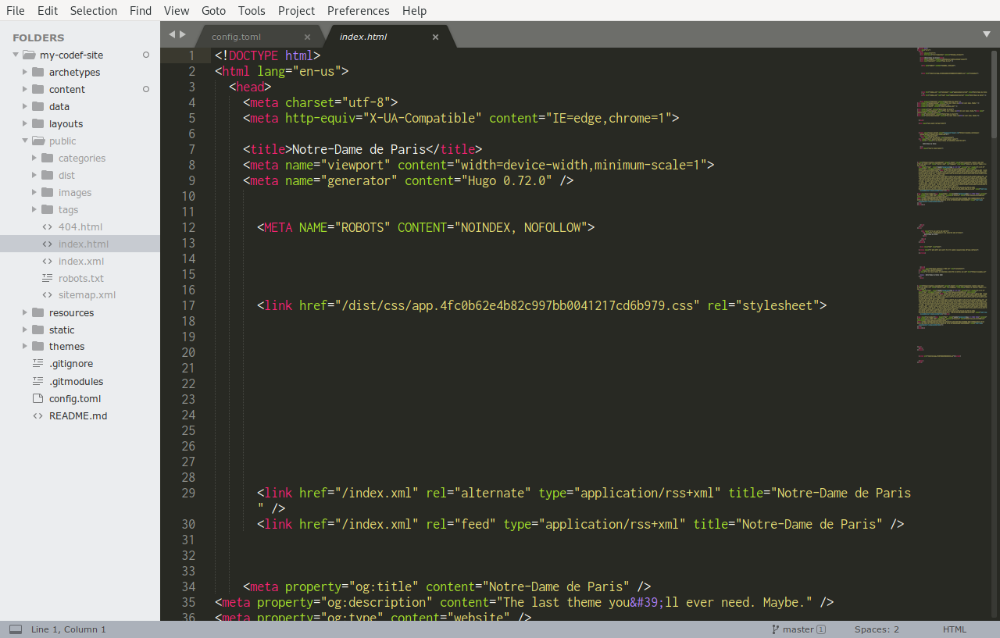

We've made a content file in `content/_index.md`. Once you start adding content to it, you should see output generated in the `public/` folder.

If we open one of the `.html` files in Sublime, we should see some text and lots of angle brackets.



This looks messy, and it is, becuse this is generated by Hugo. These files are not meant to be read by humans.

You rarely have to write big files of HTML by hand, it's almost always generated, but it's worth being aware of it.

HTML is a structured format and requires starting and closing tags. Tags are specified in angle brackets, and closing tags have a forward slash after the opening angle bracket. Like this `<i>text</i>`.

Some quick examples are

- markdown `_` and `*` translate to `<i></i>` in HTML
- markdown `__` and `**` translate to `<b></b>` in HTML
- markdown backtick translates to \<code>\</code>

You will often encounter HTML when, e.g., trying to embed some content from another site. A popular example would be YouTube, you can embed a player into your page. When you select that option on the site, it gives you an HTML fragment to copy and paste.

The most important part to know about HTML in terms of content is that **markdown allows HTML in it**. You can mix the two.

This allows you to, e.g,. embedding YouTube players directly into your content.

So you could be writing content, and then suddenly

<iframe width="560" height="315" src="https://www.youtube.com/embed/dQw4w9WgXcQ" frameborder="0" allow="accelerometer; autoplay; encrypted-media; gyroscope; picture-in-picture" allowfullscreen></iframe>

and then carry on writing content.

### Config note
This power can be used for great good, but also great evil. For sites that have other contributors, they might sneak in some malicious stuff, so putting HTML in your markdown is disabled by default.

If you want to embed things in your pages, you'll need to put these lines in your `config.toml` file.

```toml
[markup]
  [markup.goldmark]
    [markup.goldmark.renderer]
      unsafe = true
```

There are tons of other options for the Markdown renderer, they're all documented [on the Hugo site](https://gohugo.io/getting-started/configuration-markup/).

# Let's make some content
We want to allow you the freedom to create whatever site you like, but let's assume all sites need an `About` page.

To create one, we can enter

```
hugo new about/_index.md
```

This should leave us with 2 pages, a main `content/_index.md` and an "About" page in `content/about/_index.md`.

Creating the `About` section also magically adds a link to it in the top part of the page.

## Writing some content
We can now put some content in any of our two pages and see what happens.

To see the output change as you type it, you'll need to have a terminal with `hugo server -D` running, but that's it. If that's set up, you should be able to type some content, and every time you save the file, your website should update.

### It doesn't look quite right
We'll cover changing the _look_ and _layout_ in Lesson 4. You can change some basic things like background colour and font via the `config.toml` file.

### Menus
Most of your content right now will be centred. This is because all of the pages we've created so far are _list_ pages.

We mentioned earlier that Hugo expects a certain structure, i.e., `content > category > individual-pages.md`.

This is useful for the majority of cases, e.g., blogs, but all we're _really_ doing under the bonnet is using Hugo's [menu system](https://gohugo.io/content-management/menus/).

On a basic level, Hugo has "list" and "single" pages. List pages are supposed to contain links to further nested pages, and "single" pages are a final destination. In this course, the home page and the lesson sections are "list" pages, and each individual lesson is a "single" page. A "list" page is a folder, that optionally contains an `_index.md` file for its content. A "single" page is either just a markdown file, or a folder containing an `index.md` file (note the lack of the underscore).

By default, all top level "list" pages are put in the menu. You can, however, force any page into the menu should you so desire, including putting a "single" page into the top level. This is useful for things like `about` and `contact` pages.

You do this via the _front matter_, the bit at the top in the dashes.

Let's create another new page by running

```
hugo new contact.md
```

You should see a new file appear in your Sublime, let's edit it.

To make it appear in the top level navigation, we need to add a line to the front matter that says

```yaml
menu: "main"
```


This should make the new page appear in the menu, and format as a "single" page.

You can do this to any page, and technically Hugo supports having an infinite number of menus you could use for any purpose, but utilising them fully requires "templating" which is something we'll learn about next time.

## Go forth and conquer
You should now have all the tools necessary to create some basic content

To recap, we can

- make new content by running `hugo new ...`
- write content in markdown
- embed HTML for external content
- add any page we want to the main top navigation
- customise our site via the `config.toml` file

# Further reading

## Github flavoured markdown
We mentioned Github has some extensions to markdown -- they're pretty useful, and you can read more about those [on Github](https://guides.github.com/features/mastering-markdown/#GitHub-flavored-markdown).

## HTML
Mozilla have extensive documentation on HTML. A good start is their [Intro to HTML](https://developer.mozilla.org/en-US/docs/Learn/HTML/Introduction_to_HTML) guide.

A full reference for all HTML elements is also available [on their site](https://developer.mozilla.org/en-US/docs/Learn/HTML/Introduction_to_HTML#Elements_%E2%80%94_the_basic_building_blocks)

## Content organisation
The layout we spoke about that Hugo expects is just the default. You can achieve anything you want with [Page Bundles](https://gohugo.io/content-management/page-bundles/) and [Menus](https://gohugo.io/content-management/menus/).
