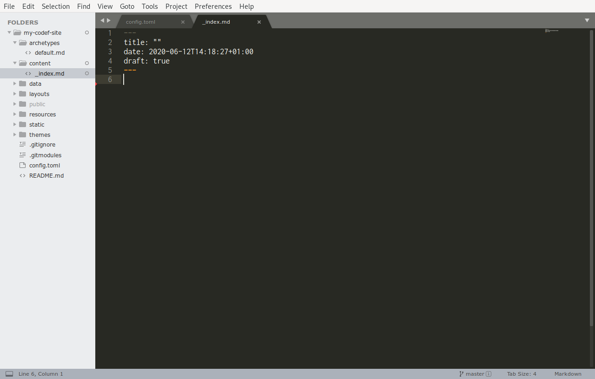

# Let's make some content
Hugo is pretty loose about its expectations, but it does require _some_ structure. That structure somewhat also depends on the theme used, and advanced users can tweak the theme and content locations. We're using the `ananke` theme, and the constraints are as follows:

1. All content lives in the `content/` folder
2. All top level content is list pages, i.e., "content categories", i.e., folders
3. All 2nd level content is "sections", i.e., a folder with an `index.md` file, or a single file

In practice this means that we want a structure like

```
content
├── _index.md
├── my-hamsters
│   ├── julio.md
│   └── sergio
│       ├── index.md
│       ├── pic1.jpg
│       └── pic2.jpg
└── posts
    ├── my-first-post.md
    └── my-second-post
        └── index.md
```

For pages that list other pages, e.g., the home page or any of the "categories", you can add an `_index.md` file to provide the main content.

You can read more about _Content Sections_ on the [Hugo site](https://gohugo.io/content-management/sections/).

We'll need to open a Terminal window in our site directory again. We did this yesterday, but as a reminder:

- for Windows, go to your site's folder in `File Explorer`, click the bar at the top with the folder names, type in `powershell`, press Enter
- for Mac, use your launcher, Cmd+Space, type `Terminal`, press Enter, type in `cd ~/Sites/my-codef-site`

Now type in

```
hugo new _index.md
```

This should get us a homepage.

We've used `_index.md` because we want the homepage to link to other content sections we make later.

You can now open the file found in `content/_index.md` in your editor. You should see an empty file with some odd looking text.



## Front matter
The bit at the top inside the 2 dashed lines is called "front matter". This contains all the meta information about your page, like the date the page was created, whether the page is published or still a draft, the title, and potentially some information used by your theme of choice too.

None of this gets directly rendered on the page, this is mostly administrative info. Some of it appears in other places in the browser, e.g., the `title` shows in the name of your browser tab / window.

We can put a name for our page in the `title` field.

Further documentation is on the [Hugo website](https://gohugo.io/content-management/front-matter/).

## Markdown
Markdown is a type of format for text, it's designed to

- be easy to use
- allow formatting of text in plain text

Markdown is intended primarily for the web, though there is definitely software out there that can convert it directly into, e.g., a PDF file.

Markdown has a few core concepts you can use to format your content. The capabilities are similar to programs like Word and Google Docs.

### Paragraphs
Newlines don't mean anything unless there's more than one. You can split your text 
into lines as you please.

A new paragraph will only start if you put an empty line in the between them.

```markdown
Newlines don't mean anything unless there's more than one. You can split your text 
into lines as you please.

A new paragraph will only start if you put an empty line in between them.
```

### Headers

Text on a new line that starts with one or more `#` is a header.

```markdown
# Title title
content content content
```

### Emphasis
Text enclosed in a single `_` or `*` is _Italic_.

Text enclosed in two `__` or `**` is **bold**.

You can _**mix and match**_.

```markdown
Text enclosed in a single `_` or `*` is _Italic_.
Text enclosed in two `__` or `**` is **bold**.
You can _**mix and match**_.
```

### Lists
You can use a `-` or `*` to make an unordered list (bullets).

- like this
  - it nests
    - by just indenting
  - levels are preserved further down

You can make an ordered list by using a number for a bullet.

1. melt the butter
1. add the flour
1. put some eggs in
1. bake

Note you can use any number, they don't have to be sequential, but they can be. If you need to edit an existing ordered list and add an item in the middle, don't worry about updating all the numbers to match.

```markdown
- like this
  - it nests
    - by just indenting
  - levels are preserved further down

1. melt the butter
1. add the flour
1. put some eggs in
1. bake
```

### Links
You can insert links [to places](https://github.com/).

```markdown
You can insert links [to places](https://github.com/).
```

### Images
You can insert images by prepending a link with a `!`.

Like this:


Also Tina says hello, she's bound to come say hi in person at some point as well.

```markdown
Like this:

```

### Quotes
You can make quotes by prepending them with `>`.

> Light travels faster than sound. This is why some people appear bright until you hear them speak.
> 
> Alan Dundes

```markdown
> Light travels faster than sound. This is why some people appear bright until you hear them speak.
> 
> Alan Dundes
```

### Code blocks
You can format things in monospace "code" font with `.

You can use them for `in-line text`, or use triple-` for entire blocks

```
like this
```

    You can use them for `in-line text`, or use triple-` for entire blocks
    
    ```
    like this
    ```

### Github flavored markdown
That covers the basics. Most of the world uses a slightly extended format called "Github Flavoured Markup", which offers some additional capabilities, e.g., like rendering tables.

You can read more about it [on Github](https://guides.github.com/features/mastering-markdown/#GitHub-flavored-markdown).

# Output
Markdown ultimately compiles to a format called _HTML_, which is what browsers consume, and what we'll cover next.
