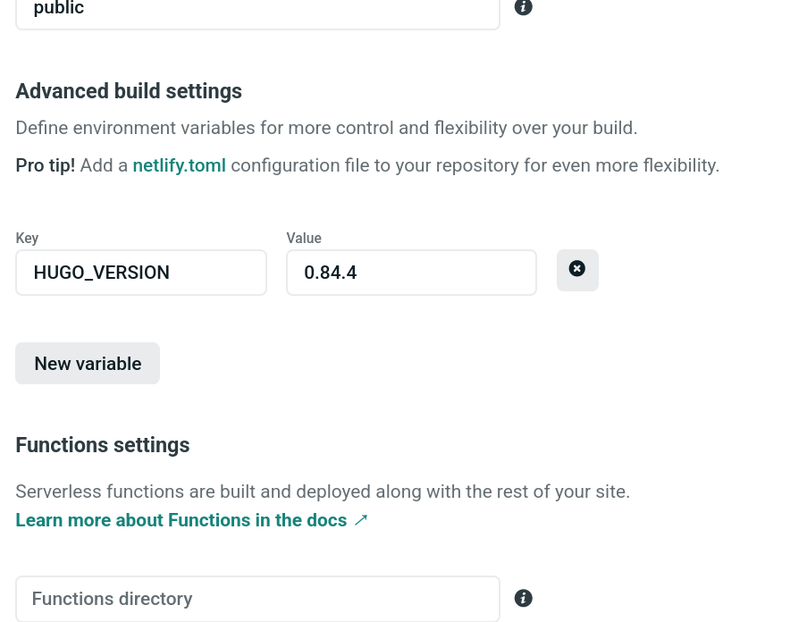

# Publishing our site
We've done some hard work over the last 2 days, now it's time to show it to the rest of the world.

## Publish a page
Before we try to publish anything, we need to tell Hugo that at least some of our content is supposed to show to the wider public.
This is managed via the _front matter_. In each of your content files you'll see a line that says `draft: true`. To make your content show up in the final output, all you need to do is change that line to `draft: false`.

## Git
We'll need to make sure all our changes are in Github. Open your GitKraken and click the `Push` button in the top row.

## Netlify

This part _sounds_ complicated, but is actually probably one of the simplest ones in this entire course. Getting something out and into the world is incredibly easy.

We'll mention up front that this is entirely free, £0.00.

We'll need to "sign up" for a site called [Netlify](https://www.netlify.com/). Open it, click the `Sign up` button in the top right corner, then pick the `Github` button.

You should see a prompt asking to authorise Netlify, click the green button to proceed. This will simply allow Netlify to read things from your Github account.

It'll show a basic "getting started" thing, close that. You should see a blank screen.

Click the button that says `New site from Git`.

It'll start a wizard, the first step is picking your provider.

Pick Github. It'll ask you to authorise some stuff again, just click the green buttons to allow Netlify.

It should return to the same screen, but with a list of "repositories" under your account. If you only created a Github account on Monday, there should only be one.

Find your `my-codef-site` in the list, and click it.

This should take you to the final screen with some settings.

These can be left as is. Click the `Show advanced` button and then click the `New variable` button. Tell Netlify to use the latest version of Hugo by adding `HUGO_VERSION` as `0.84.4`

Click the `Deploy site` button at the bottom.

It should take you back to the beginning and say that it published the site.

If you click the link it'll take you to your page.

You'll notice that the content is there, but the images are missing. Let's fix that.

## Change the site address
All you need to do to fix the images is tell Hugo where your site is deployed publicly. The reasons for this are somewhat involved, but the fix is easy.

Check your site's link in Netlify. It'll be something like `https://practical-pasteur-113dc7.netlify.app` or similar, it should be right at the top, you already just clicked it to discover your images were missing.

Now open your `config.toml` file, and paste that value into the `baseURL` bit.

Then open your GitKraken, using the right side column do stage, commit, then click `Push` at the top.

In a moment you'll see Netlify pick up the changes you pushed, a new entry will appear saying it's building the site, and eventually it'll change to green and say `Published`. If you check your site again, it should now have all the images.

You can pretty much forget about Netlify at this point, any time you `Push` your changes to Github, Netlify will pick it up from there and publish everything to your website.

### I want a nice name for it
We've skipped giving your site a nice name for now, because that involves spending money. You're looking for something called a "domain name". Options for getting one include paying Netlify, or buying one from provider, called a "registrar". Two popular and friendly choices are 
- [Namecheap](https://www.namecheap.com/)
- [Google Domains](https://domains.google.com/registrar/) 

If you have an Amazon Web Services account already, their offering, Route 53, has domain management built-in, but it's all just [Gandi](https://www.gandi.net/en-GB) behind the scenes (also a good provider).

A popular option you _don't_ want is GoDaddy, they've had some serious security issues historically and security is one of the top things you want in a domain name.

A .com domain costs about £10 per year, prices vary for others like .io or .london and can be between £2 and £100. If you would like help setting one up, we're happy to assist, but this is absolutely not necessary for this course.
