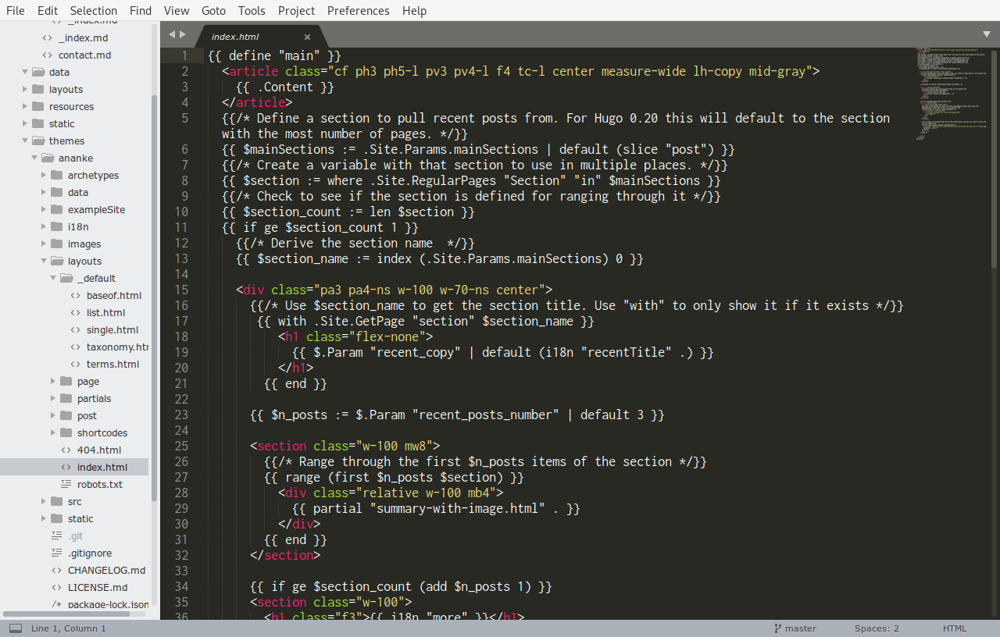

Now that we have our basic site up and running, let's look at how we can _really_ make this site our own.

This is delving into slightly more advanced territory, but everything we'll do is incremental, and if you make a mistake, you can always use Git to revert your changes.

# Layouts & templates
The final output of your website is primarily 2 things, HTML, which we covered in our previous lesson, and CSS, which we'll cover in our next lesson.

We'll focus on the HTML aspect now. HTML is what browsers use and understand, and Hugo is basically just a convenient tool to generate HTML. Markdown gets converted into HTML and inserted into other HTML. We saw some of this generated HTML earlier, it looked somewhat messy. In fact, you can see all your site's output in the `public/` folder of your site.

Exactly _what_ HTML is generated by Hugo is controlled by a feature called _templates_. _Templates_ are bits of HTML with placeholders for your content.

Let's have a look. Let's find and open the file `themes > ananke > layouts > index.html` in Sublime.



We should see a ton of HTML, and a whole bunch of curly braces. This is a _template_. Specifically, this is the template for your main home page.

The relevant part here is line 3, where it says `{{ .Content }}`. That's where the compiled content of your markdown from `content/_index.md` goes. Everything below that is just functionality for blogging, it implements showing "most recent posts".

## Lookup order
We're going to tweak some templates to better match our site.

Hugo has some special templates that it expects to find, `layouts/index.html` is one of them. It also has a [lookup order](https://gohugo.io/templates/lookup-order/), but basically it'll look for the file in 2 places -- your site's `layouts/` folder, then your **theme's** `layouts/` folder, and then it'll either assume a default value if possible, or crash & fail if not.

This means that if we want to change some particular aspect about our site, we can copy the layout file from the theme into our `layouts/` folder, tweak it, and if we don't like it, just delete it to go back to the original theme's layout.

If we're not making a blog, we don't need the "most recent posts" functionality, so let's remove that.

First, copy the file `my-codef-site > themes > ananke > layouts > index.html` to `my-codef-site > layouts > index.html`.

Then we open that in our editor, and remove lines 5-54. We should be left with just

```html
{{ define "main" }}
  <article class="cf ph3 ph5-l pv3 pv4-l f4 tc-l center measure-wide lh-copy mid-gray">
    {{ .Content }}
  </article>
{{ end }}
```

## Partials
We will now look at the file `themes > ananke > layouts > _default > list.thml`. Opening it in our editor, we can see it's fairly small, 16 lines total.
This is the template that governs **all** "list" pages. Changing this should change every category level page you have.

The 2 relevant parts in this template are

```
{{- .Content -}}
```

which will output the content of your `_index.md` files, and 

```
{{ range .Paginator.Pages }}
  <div class="relative w-100 w-30-l mb4 bg-white">
    {{- partial "summary.html" . -}}
  </div>
{{ end }}
```

which will create a summary box for each of the nested pages by using [pagination](https://gohugo.io/templates/pagination/).

It also uses a feature called [partials](https://gohugo.io/templates/partials/). _Partials_ allow you to define small bits of reusable templates. They're also often used to simply split up a bigger file.
Partials are referred to by name, and Hugo looks for them in the `layouts > partials >` folder.

If we open the file `themes > ananke > layouts > partials > summary.html`, we can see some HTML, and some placeholders like 

- `{{ .Permalink }}`, which is the full link to a page
- `{{ .Title }}`, which is the page's title
- `{{ .Summary }}`, which is a magic value computed by Hugo, containing the first X words of the page

The full list of available placeholders, called _variables_, is in [the official documentation](https://gohugo.io/variables/page/).

For any of these files, we could copy them from the theme directory into our local one and tweak it. For example, maybe we don't like the summary part, and want the link box to contain just the page title.

To achieve that, we would copy the file `themes > ananke > layouts > partials > summary.html` to `layouts > partials > summary.html`, and delete the part that has `{{ .Summary }}`. Hugo would pick up our customised summary template and produce a site without summaries.

This can be done for any template we want to tweak, and working bit by bit, we can change the entire site.

# Shortcodes
Finally, Hugo has another mechanism to insert HTML into your pages, called [shortcodes](https://gohugo.io/content-management/shortcodes/). _Shortcodes_ are basically just templates you can call from your **markdown** files, not other templates.

You call a _shortcode_ by using 

    {{ % shortcode-name shortcode-parameters %}}

or 

    {{ % shortcode-name %}} some text in between {{ % /shortocode-name %}}

if the shortcode requires content inside it, without the space between the `{{` and the `%`.
Hugo has some [built-in shortcodes](https://gohugo.io/content-management/shortcodes/#use-hugos-built-in-shortcodes) you can try, e.g., an _Instagram_ one.

You'd use this in a content file, like `_index.md`, 

    {{ % instagram B6OfP2wBi4C %}}

{}

Same thing, no space in the opening sequence.

## Custom shortcodes
You can also create [your own shortcodes](https://gohugo.io/templates/shortcode-templates/). Your custom shortcodes go in the `layouts > shortcodes` folder.

They can be plain HTML, or use some logic, but that's delving deeper into "programming". Hugo has extensive documentation on how to write your own if you feel like giving it a try.

# Further reading

## Domain names, DNS

## Hugo

### Page types, layouts

### Gomplate
