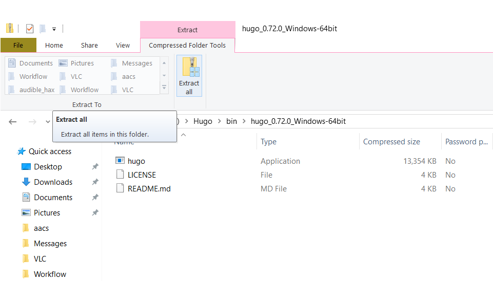
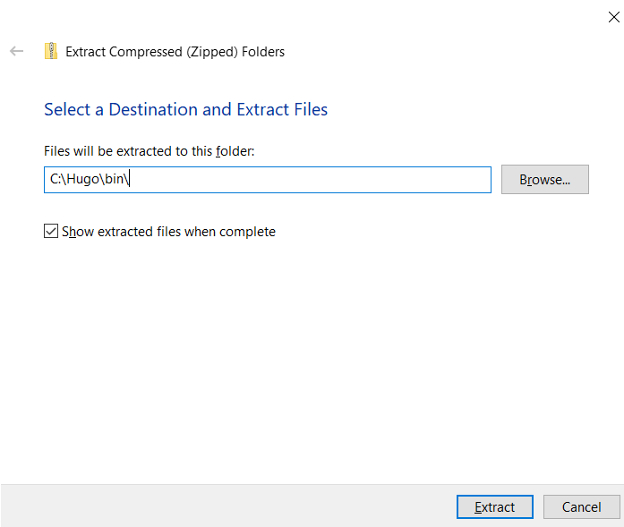
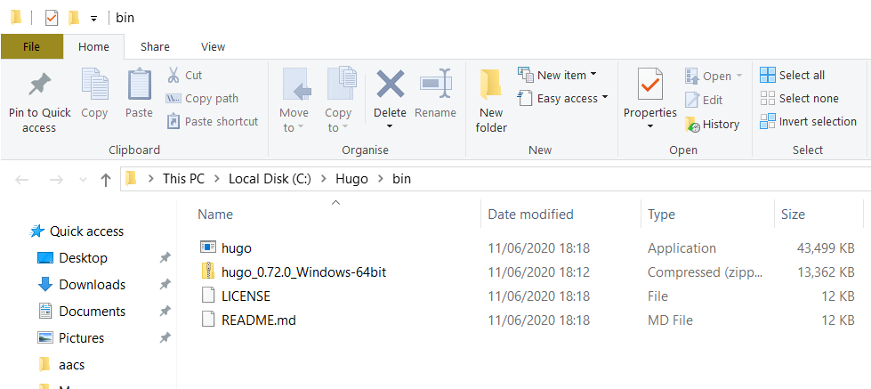
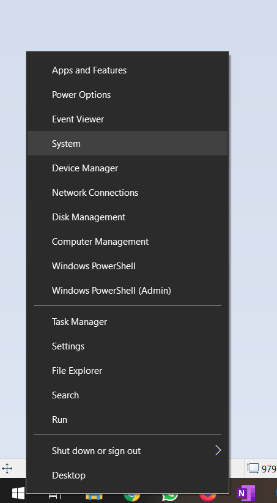
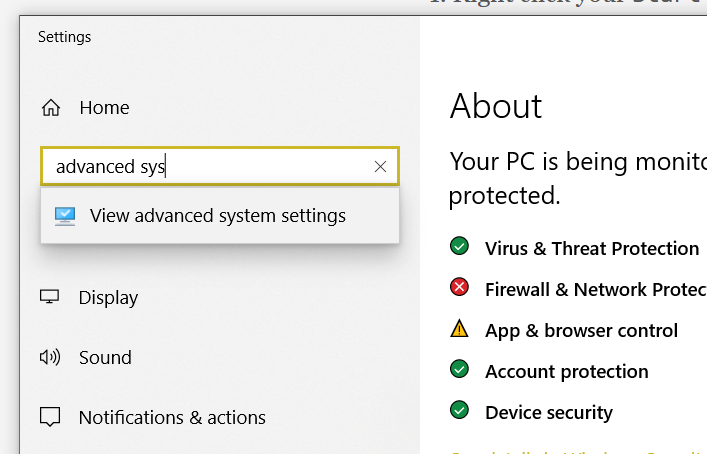
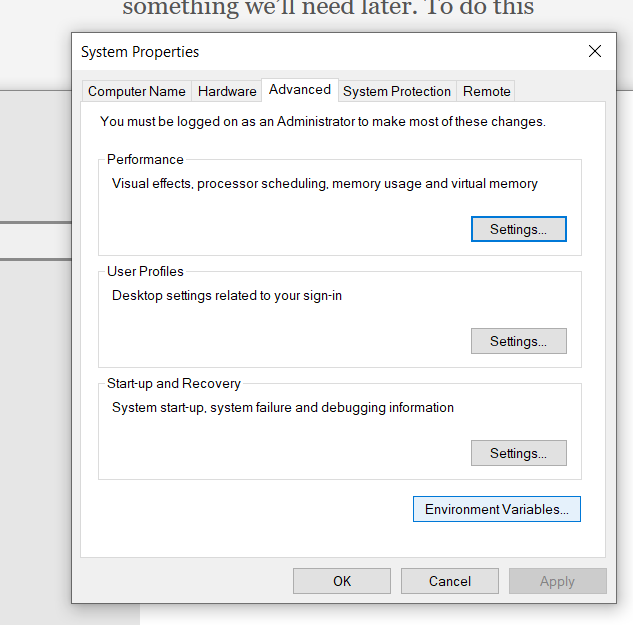
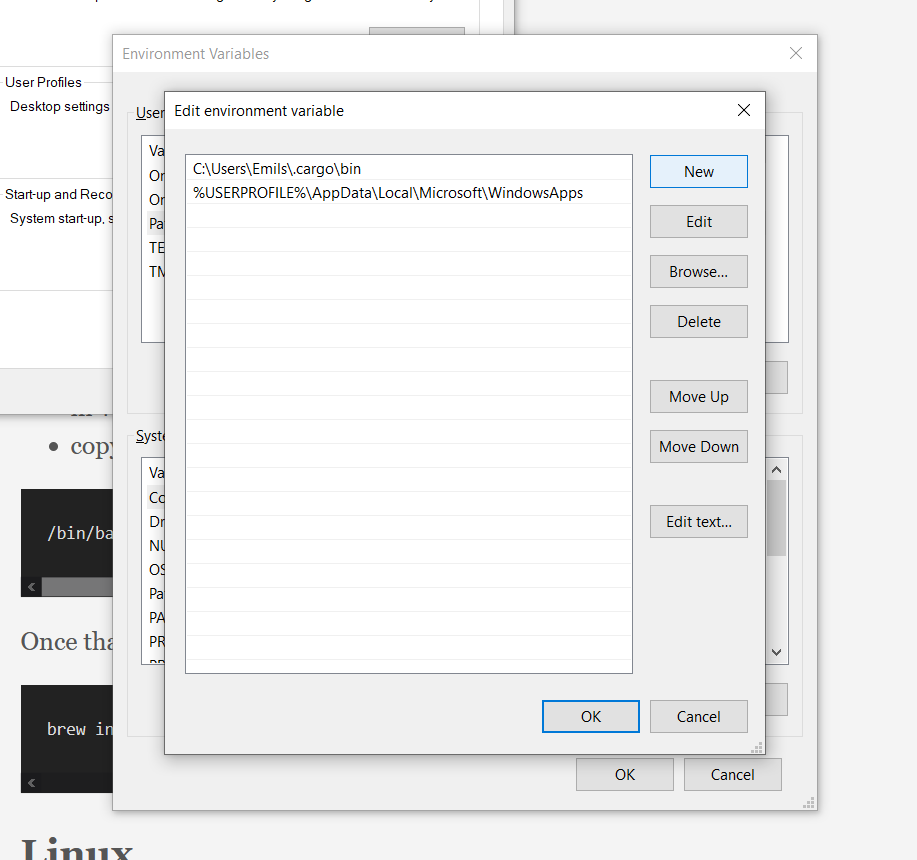
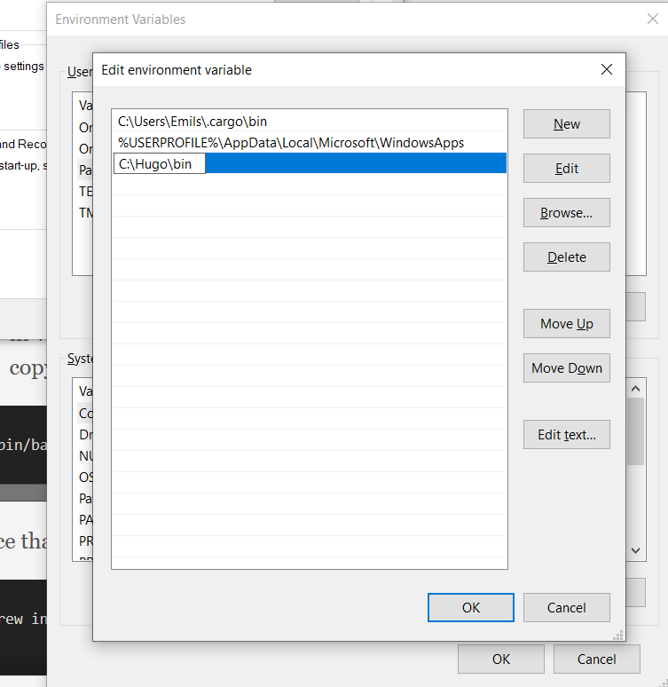

If you're using a package manager like Chocolatey, it should be present there.

If not, you should be able to follow the [official installation directions](https://gohugo.io/getting-started/installing#less-technical-users)

What you'll need to do is

1. Download a Windows [release of Hugo](https://github.com/gohugoio/hugo/releases/download/v0.84.2/hugo_0.84.2_Windows-64bit.zip)
2. Make a directory named `Hugo` in your `C:` drive
3. Make a directory named `bin` in the newly made `Hugo` diretory
4. Move the file you downloaded into this `bin` folder

5. Unzip the file directly into the `bin` directory

6. You should now see 3 files, one of which is `hugo.exe`

Then you'll need to make Hugo executable from a terminal, which is something we'll need later. To do this

1. Right click your `Start` button
2. Click `System`

3. Start typing `Advanced System Settings` into the search bar

4. Click on the `Environment Variables` button on the bottom

5. In the `User variables` section, find the row that starts with `PATH` (PATH will be all caps)
6. Double-click on `PATH`

7. Click the `New` button
8. Type in `C:\Hugo\bin`, press Enter

9. Click `OK` at every window to exit

